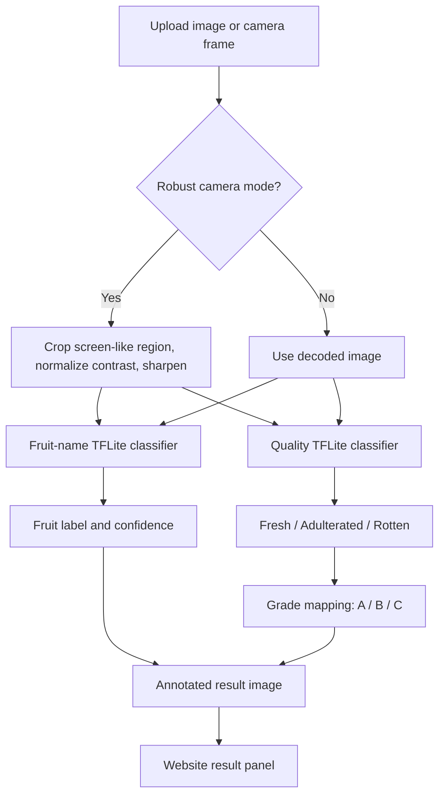

# Fruit Quality Detector for SMS

Quality-first fruit grading web app built as a lightweight Raspberry Pi 5 ready system.

Repository: <https://github.com/mohammednafees1007-hub/fruit-quality-detector-for-sms>


## Project Snapshot

| Item | Current Build |
| --- | --- |
| Main objective | Detect fruit quality and assign grade |
| Output | Fruit name, quality, A/B/C grade, confidence, annotated image |
| Runtime model count | 2 small TFLite models |
| Model 1 | Fruit-name classifier: `fruit_type_classifier.tflite` |
| Model 2 | Quality grader: `fruit_quality_grader.tflite` |
| Fruit-name dataset | Hugging Face Fruits-360 + FruitBench |
| Quality dataset | FruitBench quality labels |
| Removed runtime models | YOLOv8x, YOLOv8n runtime, CLIP, VGG19, ImageNet MobileNet fallback |
| Future deployment | Raspberry Pi 5 with Pi Camera |

## Objective

The objective is to build a practical fruit quality grading system for SMS that can:

- Identify the fruit name.
- Classify quality as `Fresh`, `Adulterant`, or `Rotten`.
- Convert quality into a simple grade:

| Quality | Grade | Meaning |
| --- | --- | --- |
| Fresh | A | Good fruit |
| Adulterant / Damaged | B | Not ideal; needs caution |
| Rotten | C | Bad fruit |

The app is designed for a final Raspberry Pi 5 deployment, so the runtime must stay small, fast, and easy to run without a GPU.

## Introduction And Motivation

Fruit quality checking is usually done manually. Manual checking is slow, inconsistent, and difficult to scale. A camera-based system can help by giving a quick grade from an image.

The first experimental version used many models: YOLOv8x, CLIP ViT-L/14, CLIP ViT-B/32, VGG19, MobileNet fallback, and a Keras quality model. That was useful for testing, but it was too heavy for Raspberry Pi 5 and created wrong results in camera scenes. For example, when a fruit image was shown on a phone screen, generic YOLO could detect the wrong object and label the scene as `Apple`.

This version is rebuilt as a lean production-style system:

```text
Image or camera frame
  -> fruit-name TFLite classifier
  -> quality TFLite classifier
  -> grade mapping
  -> website result
```

## Why These Models Are Used

### Model 1: Fruit-Name TFLite Classifier

Runtime file:

```text
models/fruit_type_classifier.tflite
```

Purpose:

- Predict fruit name directly from the image.
- Covers 65 normalized fruit/produce classes.
- Fixes the generic YOLO problem where phone screens, hands, or background objects were being boxed incorrectly.

Why this model is used:

- It is small: about 1.6 MB.
- It runs with TensorFlow Lite.
- It knows fruit classes such as mango and pomegranate because it was trained from fruit datasets.
- It is better for the current demo than generic COCO YOLO because the task is naming a fruit, not detecting random objects.

Training data:

- `PedroSampaio/fruits-360` from Hugging Face.
- `TJIET/FruitBench` from Hugging Face.

Current fruit-name test result:

| Metric | Value |
| --- | ---: |
| Accuracy | 95.74% |
| Macro-F1 | 95.56% |
| Class count | 65 |

Important class results:

| Fruit | Precision | Recall | F1 |
| --- | ---: | ---: | ---: |
| Apple | 94.34% | 55.56% | 69.93% |
| Banana | 100.00% | 92.22% | 95.95% |
| Mango | 83.33% | 100.00% | 90.91% |
| Pomegranate | 88.24% | 100.00% | 93.75% |

```text
Fruit model accuracy  | ########################-- | 95.74%
Fruit model macro-F1  | ########################-- | 95.56%
```

### Model 2: Quality Grader TFLite Classifier

Runtime file:

```text
models/fruit_quality_grader.tflite
```

Purpose:

- Predict fruit quality:
  - `fresh`
  - `adulterated`
  - `rotten`
- Convert the predicted quality into Grade A/B/C.

Why this model is used:

- It is the main model for the project because the project is quality and grading focused.
- It is small: about 2.5 MB.
- It runs with TensorFlow Lite, which is better for Raspberry Pi 5 than full Keras/TensorFlow runtime.
- It does not guess with visual fallback rules. If the model is missing, the API refuses grading clearly.

Current quality test result:

| Metric | Value |
| --- | ---: |
| Accuracy | 76.79% |
| Macro-F1 | 76.54% |
| Macro recall | 76.79% |

Per-class recall:

| Quality | Recall |
| --- | ---: |
| Fresh | 91.07% |
| Adulterated | 71.43% |
| Rotten | 67.86% |

```text
Fresh       | #######################--- | 91.07%
Adulterant  | ##################-------- | 71.43%
Rotten      | #################--------- | 67.86%
```

Discussion:

- Fruit naming is now strong.
- Quality grading is usable, but it is still the part that needs the most future improvement.
- Rotten and adulterated need more diverse training images to become production reliable.

## Why Not Use YOLO, CLIP, VGG19, Or One Huge Model?

| Option | Why it was not used in final runtime |
| --- | --- |
| YOLOv8x | Accurate but too heavy for Raspberry Pi 5 CPU |
| Generic YOLOv8n | Small, but COCO classes are not enough for mango, pomegranate, and many fruits |
| CLIP ViT-L/14 | Good zero-shot naming, but too large and slow for Pi 5 |
| VGG19 | Old, heavy, and not efficient for edge deployment |
| ImageNet MobileNet fallback | Only a fallback, not a project-trained model |
| One combined model | Possible, but needs labels like `apple_fresh`, `apple_rotten`, `banana_fresh`, etc. This becomes hard to scale |

The current two-model design is the best practical balance:

- One small model for fruit name.
- One small model for quality and grade.
- No heavy fallback stack.
- Easier to deploy on Raspberry Pi 5.

## System Components

| Component | File | Role |
| --- | --- | --- |
| Web app and API | `main.py` | FastAPI backend, UI, `/detect`, `/health` |
| Fruit dataset prep | `prepare_fruit_type_dataset.py` | Builds fruit-name image folders from Hugging Face cached datasets |
| Fruit model training | `train_fruit_type_classifier.py` | Trains and exports fruit-name TFLite model |
| Quality dataset prep | `prepare_quality_dataset.py` | Builds quality image folders |
| Quality model training | `train_quality_backbone.py` | Trains quality model |
| Quality TFLite export | `export_quality_tflite.py` | Converts quality Keras model to TFLite |
| Launcher | `run_website.bat` | Starts local website |
| Requirements | `requirements.txt` | Python dependencies |

## Workflow



## Algorithm

```text
1. Receive image from upload or camera.
2. Decode image with OpenCV.
3. If Camera Robust Mode is enabled:
   a. Detect screen-like rectangular region.
   b. Crop or warp that region.
   c. Improve contrast and brightness.
   d. Apply sharpening.
4. Run fruit_type_classifier.tflite.
5. Run fruit_quality_grader.tflite.
6. Map quality class to grade:
   fresh -> Grade A
   adulterated -> Grade B
   rotten -> Grade C
7. Draw full-frame annotation with fruit, quality, grade, and confidence.
8. Return JSON plus annotated image to the website.
```

## API

### `GET /health`

Reports runtime readiness.

Example important fields:

```json
{
  "model_mode": "hf_fruit_classifier_minimal",
  "runtime_model_count": 2,
  "fruit_type_model_ready": true,
  "fruit_type_class_count": 65,
  "quality_model_ready": true,
  "fruit_name_source": "fruit_type_tflite_model",
  "grading_mode": "quality_first_hf_fruit_classifier"
}
```

### `POST /detect`

Accepts one image file and returns the prediction.

Example response shape:

```json
{
  "overall": {
    "class": "fresh",
    "label": "Fresh",
    "grade": "A",
    "grade_label": "Grade A",
    "class_conf": 0.69,
    "source": "tflite_quality_model"
  },
  "fruit": {
    "name": "mango",
    "label": "Mango",
    "confidence": 0.75,
    "source": "fruit_type_tflite_model"
  }
}
```

## Current Runtime Test Examples

These are local endpoint tests using held-out Hugging Face fruit samples.

| Sample | Fruit Output | Fruit Confidence | Quality Output | Grade |
| --- | --- | ---: | --- | --- |
| Apple | Apple | 84.28% | Fresh | A |
| Banana | Banana | 47.46% | Rotten | C |
| Mango | Mango | 75.22% | Adulterant | B |
| Pomegranate | Pomegranate | 92.55% | Rotten | C |

The fruit-name model fixes the previous `mango shown as apple` type of failure. The quality result depends on the quality model dataset and still needs stronger data for final production accuracy.

## Installation

```powershell
git clone https://github.com/mohammednafees1007-hub/fruit-quality-detector-for-sms.git
cd fruit-quality-detector-for-sms
python -m venv .venv
.\.venv\Scripts\activate
pip install -r requirements.txt
```

## Run The Website

```powershell
.\run_website.bat
```

Open:

```text
http://127.0.0.1:8000/
```

## Training

### Prepare Fruit-Name Dataset

This uses Hugging Face cached datasets:

```powershell
.\.venv\Scripts\python.exe prepare_fruit_type_dataset.py
```

Output:

```text
data/fruit_type_training/imagefolder/train/{fruit_class}
data/fruit_type_training/imagefolder/val/{fruit_class}
data/fruit_type_training/imagefolder/test/{fruit_class}
```

### Train Fruit-Name Model

```powershell
.\.venv\Scripts\python.exe train_fruit_type_classifier.py --epochs 5 --image-size 128 --batch-size 64
```

Outputs:

```text
models/fruit_type_classifier.keras
models/fruit_type_classifier.tflite
models/fruit_type_classes.json
models/fruit_type_classifier.metrics.json
```

### Prepare Quality Dataset

```powershell
.\.venv\Scripts\python.exe prepare_quality_dataset.py
```

Output:

```text
data/quality_training/imagefolder/train/{adulterated,fresh,rotten}
data/quality_training/imagefolder/val/{adulterated,fresh,rotten}
data/quality_training/imagefolder/test/{adulterated,fresh,rotten}
```

### Train Quality Model

```powershell
.\.venv\Scripts\python.exe train_quality_backbone.py --backbone mobilenetv2 --image-size 160 --batch-size 24 --epochs 10 --fine-tune-epochs 0
```

### Export Quality Model

```powershell
.\.venv\Scripts\python.exe export_quality_tflite.py
```

Output:

```text
models/fruit_quality_grader.tflite
```

## Raspberry Pi 5 Deployment Direction

For Raspberry Pi 5, the target runtime should stay close to this:

```text
Pi Camera
  -> Camera Robust Mode preprocessing
  -> fruit_type_classifier.tflite
  -> fruit_quality_grader.tflite
  -> Grade result
```

Why this is suitable for Pi 5:

- Both runtime models are small.
- TensorFlow Lite is lighter than full TensorFlow.
- No CLIP or VGG memory load.
- No YOLO CPU bottleneck in the current runtime.
- The app can later connect to Pi Camera capture.

Future Pi optimization:

- Quantize both TFLite models to int8.
- Benchmark inference time, memory, FPS, and temperature.
- Use Raspberry Pi AI Kit / AI HAT+ if acceleration is available.
- Add a custom lightweight YOLO only if real object localization becomes necessary.

## Limitations

- Quality grading still needs more diverse fresh, rotten, and adulterated images.
- Phone-screen captures are difficult because the camera sees glare, screen pixels, and reflections.
- The current fruit model is classification-based, so it names the main visible fruit but does not detect multiple fruits separately.
- The final Pi Camera stack must be tested on Raspberry Pi OS.

## Future Enhancements

1. Improve the quality dataset with more rotten and adulterated images.
2. Add public fresh/rotten fruit datasets from Hugging Face or Kaggle where licensing allows.
3. Fine-tune EfficientNetV2B0 or MobileNetV3 for better quality grading.
4. Quantize both TFLite models for Raspberry Pi 5.
5. Add Pi Camera capture support.
6. Add confidence thresholds with `Retake image` message for low-confidence predictions.
7. Add optional custom YOLOv8n/YOLO11n detector only if multi-fruit bounding boxes are required.
8. Add a final dashboard with grade history and CSV export.

## References

1. PedroSampaio Fruits-360 on Hugging Face: <https://huggingface.co/datasets/PedroSampaio/fruits-360>
2. TJIET FruitBench on Hugging Face: <https://huggingface.co/datasets/TJIET/FruitBench>
3. Densu341 Fresh-rotten-fruit on Hugging Face: <https://huggingface.co/datasets/Densu341/Fresh-rotten-fruit>
4. TensorFlow Lite Guide: <https://www.tensorflow.org/lite/guide>
5. MobileNetV2 paper: <https://arxiv.org/abs/1801.04381>
6. EfficientNetV2 paper: <https://arxiv.org/abs/2104.00298>
7. Raspberry Pi 5: <https://www.raspberrypi.com/products/raspberry-pi-5/>
8. Raspberry Pi AI HAT+: <https://www.raspberrypi.com/documentation/accessories/ai-hat-plus.html>
