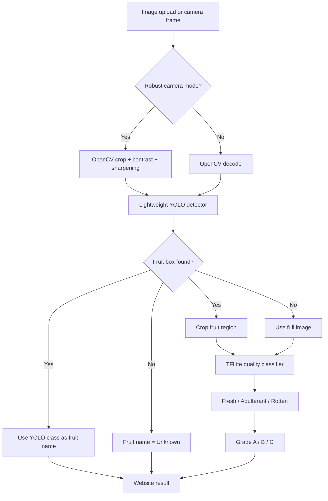
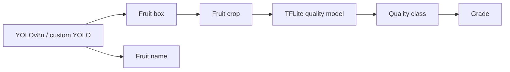
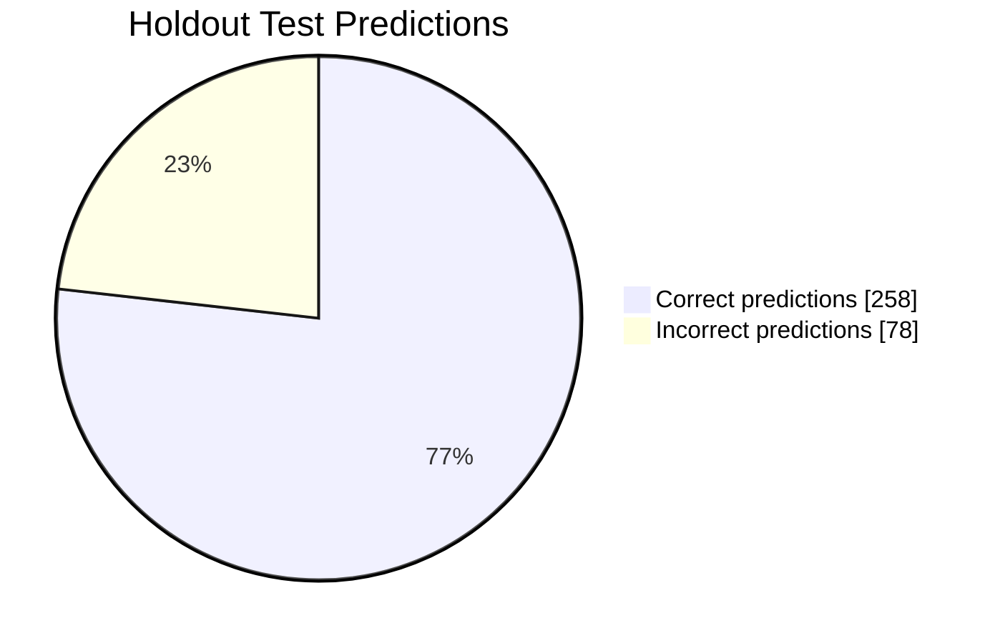

# Fruit Quality Detector for SMS

Minimal-model fruit quality grading system built for a Raspberry Pi 5 future deployment.

Repository: <https://github.com/mohammednafees1007-hub/fruit-quality-detector-for-sms>


## Project Snapshot

| Item | Current Decision |
| --- | --- |
| Main goal | Fruit quality and grade detection |
| Final runtime model count | 2 models |
| Model 1 | Lightweight YOLO detector for fruit name + crop |
| Model 2 | TensorFlow Lite quality classifier for grade |
| Fruit name source | YOLO detector class |
| Quality source | TFLite quality model only |
| Removed from runtime | CLIP, VGG19, MobileNet ImageNet fallback, YOLOv8x |
| Pi 5 direction | YOLOv8n/custom detector + TFLite quality model |

## Why This Version Is Minimal

The earlier demo used several models because it was built for experimentation:

- YOLOv8x for object detection
- CLIP ViT-L/14 for fruit name
- CLIP ViT-B/32 fallback
- VGG19 fallback
- MobileNetV2 ImageNet fallback
- Keras quality classifier

That is too heavy for Raspberry Pi 5. The new runtime uses only what is needed:

```text
Image / Camera
  -> lightweight YOLO detector
  -> fruit name + fruit crop
  -> TFLite quality classifier
  -> Fresh / Adulterant / Rotten
  -> Grade A / B / C
```

## Visual Architecture



## Model Responsibility Map



## Model Choices

### Model 1: Lightweight YOLO Detector

Purpose:

- Find the fruit box.
- Give the fruit name using the detector class.
- Provide a crop for the quality model.

Current runtime behavior:

- Prefer `models/custom_fruit_detector.pt` if it exists.
- Otherwise use lightweight `yolov8n.pt` as fallback.

Why this is better than CLIP for the final system:

- One model gives both fruit location and fruit name.
- Faster and smaller than CLIP ViT-L/14.
- Easier to run on Raspberry Pi 5.
- Can be custom-trained for project fruit classes.

Important limitation:

Generic `yolov8n.pt` is not a custom fruit detector. It can detect common COCO classes such as apple, banana, and orange, but accurate naming for fruits like pomegranate, mango, and grapes needs custom YOLO training.

### Model 2: TFLite Quality Classifier

Purpose:

- Predict fruit quality:
  - `fresh`
  - `adulterated`
  - `rotten`
- Convert quality to grade:
  - `fresh -> A`
  - `adulterated -> B`
  - `rotten -> C`

Runtime model:

```text
models/fruit_quality_grader.tflite
```

Training/export model:

```text
models/fruit_quality_grader.keras
```

Why TFLite is used:

- Lighter runtime format.
- More suitable for edge devices.
- Better direction for Raspberry Pi 5.
- Can later be optimized or quantized.

## Why Not Use One Model?

One model is possible, but not the best default.

Example one-model labels:

```text
apple_fresh
apple_rotten
apple_adulterated
banana_fresh
banana_rotten
banana_adulterated
...
```

This becomes hard to scale because every fruit needs every quality label. The two-model design is cleaner:

- YOLO handles fruit name and crop.
- Quality classifier handles grade.

This gives better modularity and is easier to improve later.

## Removed Runtime Models

| Removed Model | Why Removed |
| --- | --- |
| CLIP ViT-L/14 | Too heavy for Pi 5; only needed for broad zero-shot naming |
| CLIP ViT-B/32 | Still unnecessary when YOLO gives fruit class |
| VGG19 | Old and heavy; not efficient for edge runtime |
| MobileNetV2 ImageNet fallback | Duplicate fallback; quality model already uses MobileNetV2-style classifier |
| YOLOv8x | Strong but too heavy for Pi 5 target |

## Raspberry Pi 5 Target

The future Pi 5 version should not run the old heavy model stack.

Recommended Pi 5 stack:

```text
Pi Camera
  -> YOLOv8n / YOLOv11n / custom lightweight detector
  -> TFLite quality classifier
  -> Grade result
  -> Local dashboard or SMS workflow
```

Pi 5 deployment notes:

- Use Raspberry Pi OS for Pi Camera support.
- Use TensorFlow Lite or `tflite-runtime` for quality inference.
- Benchmark FPS, latency, memory, and temperature.
- If available, use Raspberry Pi AI Kit / AI HAT+ for acceleration.

## Workflow

```text
Input image
  -> optional robust preprocessing
  -> YOLO detector
  -> fruit name from YOLO class
  -> fruit crop if YOLO detects fruit
  -> TFLite quality classifier
  -> quality class
  -> grade mapping
  -> annotated image + JSON response
```

## Grade Mapping

| Quality Class | Display Label | Grade |
| --- | --- | --- |
| `fresh` | Fresh | A |
| `adulterated` | Adulterant | B |
| `rotten` | Rotten | C |

## Project Structure

```text
FruitQualityWeb_Rebuild/
|-- main.py
|-- export_quality_tflite.py
|-- prepare_quality_dataset.py
|-- train_quality_backbone.py
|-- prepare_fruits360_yolo.py
|-- train_custom_yolo_fruits.py
|-- run_website.bat
|-- requirements.txt
|-- README.md
|-- models/
|   |-- fruit_quality_grader.keras
|   |-- fruit_quality_grader.tflite
|   |-- quality_classes.json
|   `-- fruit_quality_grader.metrics.json
`-- data/
    `-- test_images/
        |-- apple.jpg
        |-- banana.jpg
        `-- pomegranate.jpg
```

## Installation and Running

```powershell
git clone https://github.com/mohammednafees1007-hub/fruit-quality-detector-for-sms.git
cd fruit-quality-detector-for-sms
python -m venv .venv
.\.venv\Scripts\activate
pip install -r requirements.txt
.\run_website.bat
```

Open:

```text
http://127.0.0.1:8000/
```

## API

### `GET /health`

Reports the minimal runtime state.

Expected important fields:

```json
{
  "model_mode": "minimal_pi5_ready",
  "runtime_model_count": 2,
  "detector_model_ready": true,
  "quality_model_ready": true,
  "fruit_name_source": "detector_class",
  "grading_mode": "quality_first_minimal"
}
```

### `POST /detect`

Accepts an image and returns:

- annotated image
- detections
- fruit name from YOLO class
- quality result from TFLite
- grade result
- probabilities

Example:

```json
{
  "overall": {
    "class": "fresh",
    "label": "Fresh",
    "grade": "A",
    "grade_label": "Grade A",
    "source": "tflite_quality_model"
  },
  "fruit": {
    "name": "apple",
    "label": "Apple",
    "source": "lightweight_yolo_detector"
  }
}
```

## Training and Export

### Prepare quality dataset

```powershell
.\.venv\Scripts\python.exe prepare_quality_dataset.py
```

Creates:

```text
data/quality_training/imagefolder/train/{adulterated,fresh,rotten}
data/quality_training/imagefolder/val/{adulterated,fresh,rotten}
data/quality_training/imagefolder/test/{adulterated,fresh,rotten}
```

### Train quality model

Current CPU-friendly training command:

```powershell
.\.venv\Scripts\python.exe train_quality_backbone.py --backbone mobilenetv2 --image-size 160 --batch-size 24 --epochs 10 --fine-tune-epochs 0
```

### Export quality model to TFLite

```powershell
.\.venv\Scripts\python.exe export_quality_tflite.py
```

Output:

```text
models/fruit_quality_grader.tflite
```

### Train custom lightweight YOLO fruit detector

Prepare YOLO dataset:

```powershell
.\.venv\Scripts\python.exe prepare_fruits360_yolo.py
```

Train detector:

```powershell
.\.venv\Scripts\python.exe train_custom_yolo_fruits.py --model yolov8n.pt --output models\custom_fruit_detector.pt
```

The runtime automatically prefers:

```text
models/custom_fruit_detector.pt
```

If it is missing, the app falls back to:

```text
yolov8n.pt
```

## Current Quality Results

The quality model was evaluated on a holdout test set.

| Metric | Value |
| --- | ---: |
| Accuracy | 76.79% |
| Macro-F1 | 76.54% |
| Macro recall | 76.79% |

Per-class recall:

```text
Fresh       91.07% | #########################-- |
Adulterant  71.43% | ###################-------- |
Rotten      67.86% | ##################--------- |
```

Confusion matrix:

| True \ Predicted | Adulterated | Fresh | Rotten |
| --- | ---: | ---: | ---: |
| Adulterated | 80 | 9 | 23 |
| Fresh | 4 | 102 | 6 |
| Rotten | 25 | 11 | 76 |



## Limitations

- Current quality model is usable but not final-production accurate.
- Generic YOLOv8n is not enough for all fruit names.
- Accurate fruit naming needs a custom detector trained on the required fruit list.
- Pi 5 camera deployment must be tested on Raspberry Pi OS, not Windows.
- For best Pi performance, TFLite quantization and lightweight YOLO export should be benchmarked.

## Future Enhancements

1. Train a custom YOLOv8n/YOLOv11n fruit detector for the project fruit list.
2. Convert detector to a Pi-friendly format such as ONNX, NCNN, TFLite, or Hailo.
3. Quantize the quality TFLite model for faster Pi 5 inference.
4. Add Pi Camera support on Raspberry Pi OS.
5. Add FPS, latency, RAM, and temperature reporting.
6. Add Raspberry Pi AI Kit / AI HAT+ acceleration path.
7. Improve quality model with full FruitVision data.

## References

1. FruitVision dataset. <https://www.sciencedirect.com/science/article/pii/S2352340925004792>
2. FruitVision data. <https://data.mendeley.com/datasets/xkbjx8959c/2>
3. TJIET FruitBench dataset. <https://huggingface.co/datasets/TJIET/FruitBench>
4. Ultralytics YOLO documentation. <https://docs.ultralytics.com/>
5. MobileNetV2 paper. <https://arxiv.org/abs/1801.04381>
6. TensorFlow Lite guide. <https://www.tensorflow.org/lite/guide>
7. Raspberry Pi 5 product page. <https://www.raspberrypi.com/products/raspberry-pi-5/>
8. Raspberry Pi AI HAT+ documentation. <https://www.raspberrypi.com/documentation/accessories/ai-hat-plus.html>
